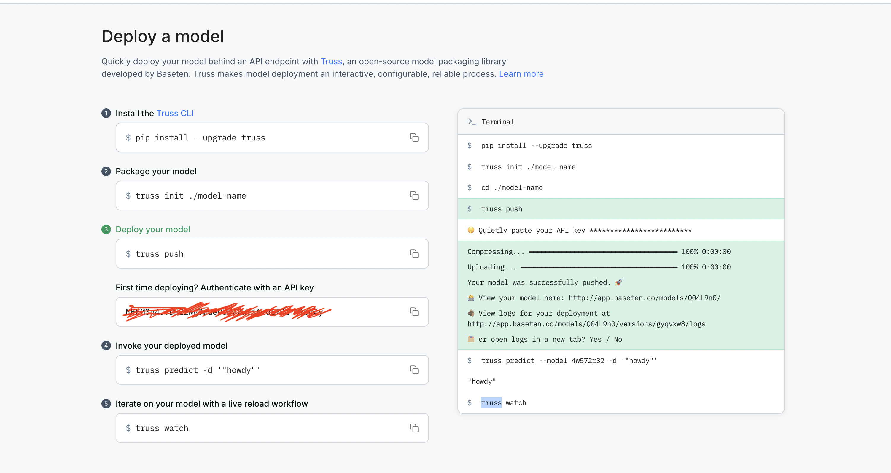
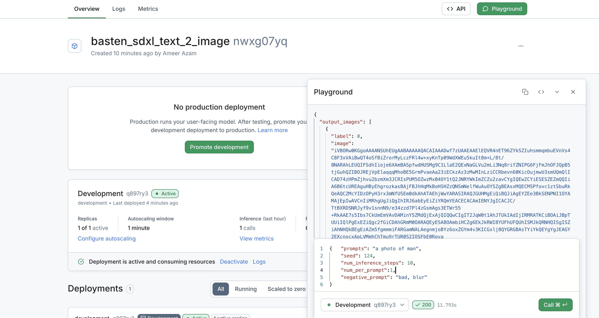

# deploy-on-baseten

[basten-process Truss](https://app.baseten.co/models/deploy)

# Steps
Truss Steps 

# Testing API on Baseten
PlayGround 

# Request API for Baseten
```python
import requests
payload = {
    "prompts": "a photo of man",
    "seed": 124,
    "num_inference_steps": 10,
    "num_per_prompt":1,
    "negative_prompt": "bad, blur"
}
basten_url= ""
BASTEN_API_KEY = ""
resp = requests.post(
    basten_url,
    headers={"Authorization": f"Api-Key {BASTEN_API_KEY}"},
    json=payload,
)
print(resp.json())

```

# Result 
Response result 